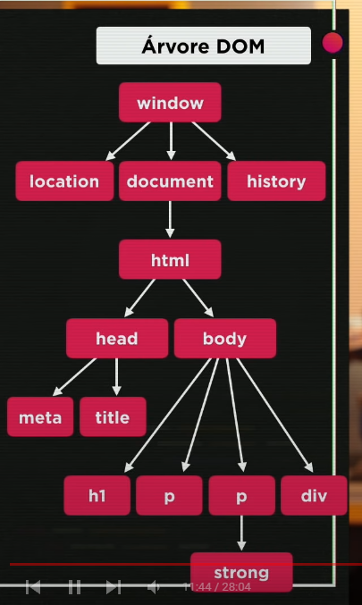

# Introdução ao DOM (Document Object Model)

## Árvore DOM

1. Window -> raiz
   1. location -> localização do site (url)
   2. document -> documento atual
      1. HTML (parent)
         1. head (child)
            1. meta
            2. title
         2. body (child)
            1. h1
            2. p
            3. p
               1. strong
            4. div
   3. history -> guarda de onde veio e para onde vai 

## Métodos de seleção na DOM

### Marca

`getElementsByTagName()` -> seleciona mais de um elemento

### ID

`getElementById()` -> seleciona um elemento

### Nome

`getElementsByName()` -> seleciona mais de um elemento

### Classe

`getElementsByClassName()` -> seleciona mais de um elemento

### Seletor (Mais recomendado)

`querySelector()` -> seleciona um elemento
`querySelectorAll()` -> seleciona mais de um elemento

> Por ID -> `#` 
> Por Classe -> `.` 
